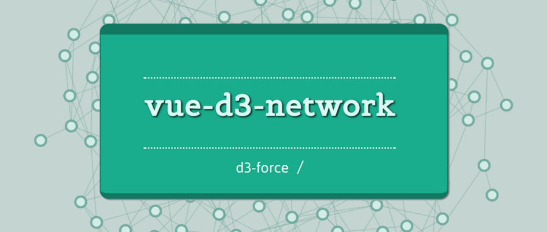

[](https://github.com/emiliorizzo/vue-d3-network/issues) [](https://raw.githubusercontent.com/emiliorizzo/vue-d3-network/master/LICENSE) [](https://www.npmjs.com/package/vue-d3-network)


## vue-d3-network
 > Vue component to graph networks using d3-force



## Demo

[Demo](https://emiliorizzo.github.io/vue-d3-network/)

## Features

- **SVG** render
- **Canvas** render
- Links and nodes selection
- **svg <-> canvas** shared styles via css
- **Screenshots**, *export as svg or png (svg renderer), export as png (canvas renderer)* 
- **Touch support**


## Installation

``` bash
npm install vue-d3-network --save

```
## Usage

- [fiddle](https://jsfiddle.net/emii/ru24unsz/)
- [codePen](https://codepen.io/emilio/pen/mwYpbj)

```xml
  ...  
  <d3-network :net-nodes="nodes" :net-links="links" :options="options" />
  ...

```
``` javascript  
import D3Network from 'vue-d3-network'
...
  components: {
    D3Network
  },
....
```
``` html

<style src="vue-d3-network/dist/vue-d3-network.css"></style>

```

Or: *import source component from:* 'vue-d3-network/src/vue-d3-network.vue'
*And install devDependencies.* (d3-force, stylus and pug) 
See: [package.json](https://github.com/emiliorizzo/vue-d3-network/blob/master/package.json))

## Props

 **net-nodes**: Array *of nodes objects*:
   
  - **id**: node id. *If not provided uses array index*
  -  **name**: node name. *If not provided uses: 'node [node_id]'*
  - **_color**: node color, e.g. *red*, *#aa00bb*,
  - **_cssClass**: node css class name
  - **_labelClass**: node label css class name
  - **svgSym**: node icon, svg document (only works in svg renderer)
  - -**_size** : node size *(svg renderer only)*
  - **_width**: node width *(svg renderer only)*
  - **_height**: node height *(svg renderer only)*
  - **_svgAttrs**: Object, svg node attributes
      

 **net-links**: Array *of links objects*: 
    
  - **id**: link id. *If not provided uses array index*
  - **name**: node name. *If not provided uses: 'link [link_id]'*
  - **tid**: id of target node
  - **sid**: id of source node
  - **_color**: link color, e.g. *red*, *#aa00bb*,
  - **_svgAttrs**: Object, svg line attributes

 **selection** : Object, *links and nodes selected*
  
  - **links**: Object with node.ids as keys, node objects as values
  - **nodes**: Object  with link.ids as keys, links objects as values

 **nodeSym**: String, *node sprite svg doc*
 
 **nodeCb**: Function(node) -> node, *node formatter*
 
 **linkCb**: Function(link) -> link, *node link formatter*

  **simCb**: Function(sim) -> sim, *d3 simulation formatter*
 
 **customForces**: Object: { [d3Function]:args }


 **options**:
  
  - **canvas**: Boolean, *render as canvas*, false = svg
  - **size**: Object, *graph size*. **Default:** container size
      - **w**: Number
      - **h**: Number
 
 - **offset**: Object, *graph center offset* 
      - **x**: Number
      - **y**: Number

  - **force**: Number
  - **forces** Object:
      - **Center**: *Boolean*, use d3.forceCenter
      - **X**: *strength*, use d3.forceX
      - **Y**: *strength*, use d3.forceY
      - **ManyBody**: *Boolean*, use d3.forceManyBody, *takes the negative value of 'force'  option*
      - **Link**: *Boolean*, use  d3.forceLink
  - 
- **nodeSize**: Number, *node radius | size in px* 
- **linkWidth**: Number, *link thickness in px*
  - **nodeLabels**: Boolean, *show nodes names*
  - **linkLabels**: Boolean, *show links names*
  - **fontSize**: Number, *for node labels, px*
  - **strLinks**: Boolean, *draw links as rect lines* 
  - **resizeListener**:Boolean, defaults: true ,add listener to window.resize event
  - **noNodes**: Boolean, *no render nodes*
- **canvasStyles**: Object


## Events

- **node-click**:  *fired when click on node*, emits **(event,node-object)**
- **link-click**:  *fired when click on link*, emits **(event, link-object)**
- **screen-shot**: *fired when screenshot creation is done*, emits **(error)**

## Methods

  - **screenShot** (name, bgColor, toSVG, svgAllCss), all arguments are optional
    - **name:** file name
    -** bgColor:** *CSS color*, png background color
    - **toSVG:** *Boolean*, (svg renderer) true: export as svg, false : export as png
    - **svgAllCss:** *Boolean* (svg renderer) true: include all styles in svg false: include only matched styles.
      *This option is useful, for example to include hover actions on exported svg file* 


## Css style and canvas style

SVG css classes:

- **.node**: nodes symbol
- **.link**: link line
- **.node-label**: nodes names
- **.node .selected**: node selected
- **.link .selected** link selected
- **node pinned**: node pinned

To use this css styles in canvas we create 'ghosts' svg elements to pick up values from computed css properties.
If you want, you can stylize the canvas elements directly, setting: options.canvasStyles, but these styles will not be applied to the svg graph.

see: [src/canvasStyles.js](https://github.com/emiliorizzo/vue-d3-network/blob/master/src/lib/canvasStyles.js)

## TODO

  - [x]  Touch support
  - []   Optimization
  - []   Zoom
  - [x]  Canvas Render
  - [x]  Nodes sprites

## More Examples

- [svg marks on links](https://codepen.io/emilio/pen/QOaQjP)
- [Links labels](https://codepen.io/emilio/pen/ZampZb)
- [no-link forces](https://jsfiddle.net/emii/4odfweq9)
- [Change node icon on the fly](https://codepen.io/emilio/pen/YOeaWN)

